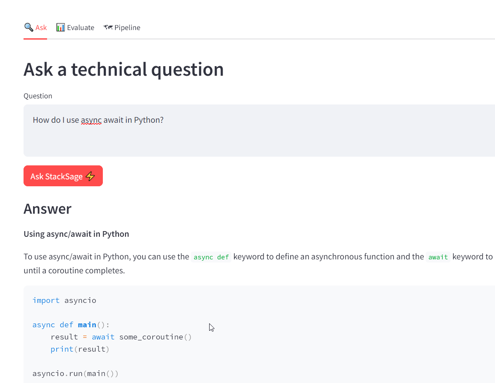
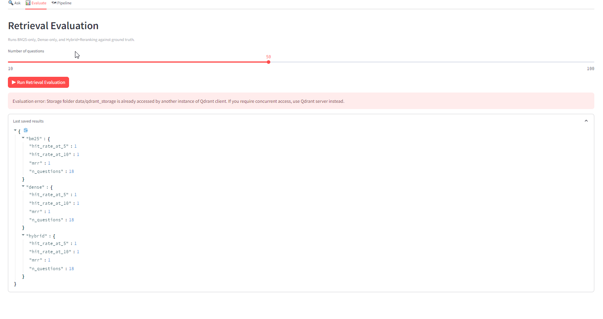
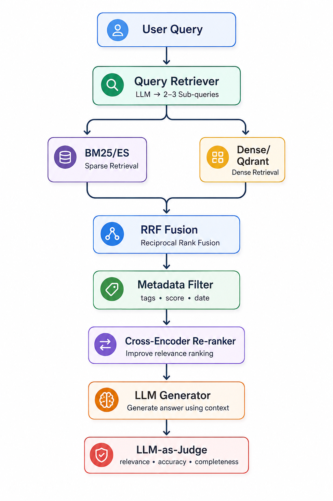
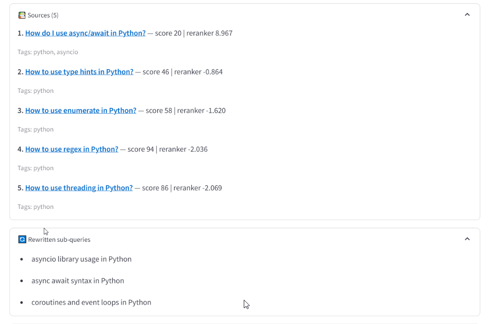
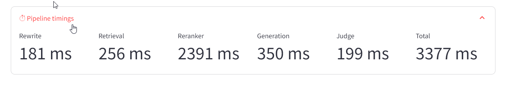

<div align="center">

# ⚡ StackSage

### Stack Overflow Intelligence Engine

**Ask a developer question. Retrieve the relevant Q&A. Rerank it. Generate an answer. Inspect every stage.**

[](https://python.org)
[](https://fastapi.tiangolo.com)
[](https://streamlit.io)
[](https://qdrant.tech)
[](LICENSE)

**No Docker is required for the core app.** Docker is used for the optional Grafana monitoring stack.

</div>

---

## What is StackSage?

StackSage is a RAG system for developer questions built around curated Stack Exchange Q&A data.

Instead of returning a list of search results, it runs a multi-step pipeline that:

1. rewrites the question into 2–3 search queries;
2. searches with BM25 and dense embeddings;
3. combines the ranked lists with Reciprocal Rank Fusion (RRF);
4. applies corpus filters such as tags, score, and date;
5. reranks candidates with a cross-encoder;
6. asks an OpenAI-compatible or local Ollama model to synthesize the answer;
7. exposes the intermediate sources, rewritten queries, scores, and stage timings in the UI/API.

The implementation is split into ingestion, retrieval, generation, API, UI, evaluation, and monitoring components so each part can be inspected independently.

> **Project:** LLM Zoomcamp 2026 capstone · **Author:** [@wimpyelio](https://github.com/wimpyelio)

---

## Why this problem?

Developer search has a useful failure mode: the answer may exist in a high-quality Stack Overflow post, but the user still has to identify the right thread, compare answers, and decide whether the result matches the question.

StackSage targets that workflow with a source-first RAG path. The answer is generated from retrieved Q&A records, while the UI keeps the underlying questions, scores, tags, rewritten queries, and pipeline timings visible.

The current ingestion/evaluation setup is scoped around Python-oriented Stack Exchange Q&A. The repository also contains tag/date filtering so the retrieval boundary can be narrowed at query time.

---

## 🧭 Architecture

```mermaid
flowchart TD
    
    A["Developer Question\n(natural language)"] --> B

    B["1. Query Rewriter\nLLM generates 2-3 search queries\nto improve recall"]

    subgraph "Retrieval"
        C2a["2a. BM25 Retrieval\nrank_bm25 over Stack Exchange questions"]
        C2b["2b. Dense Retrieval\nSentence-Transformers embedding\nsearch on Qdrant vector DB"]
        C2c["2c. Metadata Filters\nFilter by tags, minimum score,\nand optional date"]
    end

    D["3. RRF Fusion\nReciprocal Rank Fusion k=60\nmerge & score candidates"]

    E["4. Cross-Encoder Reranker\nms-marco-MiniLM-L-6-v2 reranks\ntop candidate passages"]

    F["5. Answer Generator\nLLM generates a grounded answer\nfrom top-ranked sources"]

    G["6. LLM-as-Judge\nScores answer on Relevance,\nAccuracy & Completeness 1-5"]

    H["7. Response\nAnswer, Sources, Scores, Timings,\nRewritten Queries, Judge Scores"]

    subgraph "What the user sees (UI)"
        UI1["Answer\nLLM generated answer"]
        UI2["Sources\nTop questions with score, tags, and links"]
        UI3["Rewritten Queries\nQueries used for retrieval"]
        UI4["Judge Scores\nRelevance / Accuracy / Completeness"]
        UI5["Timings\nPer-stage latency (ms)"]
        UI6["Feedback\nUser feedback stored for improvement"]
    end

    subgraph "Evaluation Pipeline"
        EP1["Retrieval Evaluation\nHit@5, Hit@10, MRR\nBM25, Dense, Hybrid"]
        EP2["Generation Evaluation\nLLM-as-Judge scores\nRelevance, Accuracy, Completeness"]
        EP3["Benchmark Dataset\nGround truth from Stack Overflow\nquestion_id"]
    end

    subgraph "Infra & Data Layer"
        ID1["Qdrant Local\nVector Database"]
        ID2["BM25 Index\nrank_bm25"]
        ID3["SQLite\nLogs, Feedback, Sessions"]
        ID4["Models\nOpenAI-compatible or Ollama"]
        ID5["Optional Monitoring\nGrafana (Docker Compose)"]
    end

    B --> C2a
    B --> C2b
    B --> C2c
    C2a --> D
    C2b --> D
    C2c --> D
    D --> E
    E --> F
    F --> G
    G --> H
    H --> UI1
    H --> UI2
    H --> UI3
    H --> UI4
    H --> UI5
    H --> UI6
    D -.-> EP1
    G -.-> EP2
    EP3 -.-> EP1
    EP3 -.-> EP2

The retriever implementation uses `rank_bm25` for lexical search and Qdrant's local client for dense search. RRF uses `1 / (60 + rank)` and merges documents by `doc_id`. Retrieval filters include minimum question score, optional tags, and an optional creation-date boundary.

The pipeline records elapsed milliseconds for rewrite, retrieval, reranking, generation, judging, and the full request.

---

## 🔬 RAG techniques demonstrated

| Technique           | StackSage implementation                          |
| ------------------- | ------------------------------------------------- |
| Query rewriting     | LLM produces 2–3 sub-queries                      |
| Lexical retrieval   | `rank_bm25` BM25 index                            |
| Dense retrieval     | `sentence-transformers` + Qdrant local ANN search |
| Score fusion        | Reciprocal Rank Fusion with `k=60`                |
| Metadata filtering  | tags, minimum question score, optional date       |
| Reranking           | `ms-marco-MiniLM-L-6-v2` cross-encoder            |
| Generation          | OpenAI-compatible endpoint or Ollama              |
| Answer evaluation   | LLM judge: relevance, accuracy, completeness      |
| Observability       | per-stage timings + SQLite query/feedback logging |
| API                 | FastAPI                                           |
| UI                  | Streamlit                                         |
| Optional monitoring | Grafana via Docker Compose                        |

---

## 📊 Evaluation

StackSage includes an evaluation runner for retrieval and generation.

The retrieval evaluator measures **Hit@5, Hit@10, and MRR** for BM25, dense retrieval, and hybrid retrieval followed by reranking.

The generation evaluator records average relevance, accuracy, completeness, and total latency from the pipeline.

### Reported retrieval benchmark

The previous project README reported the following results for an 18-question ground-truth set:

| Method             | Hit@5 | Hit@10 |  MRR |
| ------------------ | ----: | -----: | ---: |
| BM25 only          |  1.00 |   1.00 | 1.00 |
| Dense only         |  1.00 |   1.00 | 1.00 |
| Hybrid + reranking |  1.00 |   1.00 | 1.00 |

These numbers are **repository-reported results, not a fresh benchmark run in this review**.

The current evaluator can regenerate the metrics from `data/eval/ground_truth.jsonl` and writes retrieval results to `evaluation/results/retrieval_metrics.json`.

### Reported generation benchmark

The previous README also reported an LLM-as-judge result of:

| Dimension    | Reported score |
| ------------ | -------------: |
| Relevance    |          5 / 5 |
| Accuracy     |          5 / 5 |
| Completeness |          4 / 5 |

The judge is implemented as a separate component. It requests three 1–5 scores and returns structured JSON; malformed judge output is handled through a fallback result.

---

## 🖥️ Interface

The Streamlit application has three main views.

### 1. Ask

Enter a developer question and optionally constrain retrieval by:

* Stack Exchange tags;
* minimum question score;
* post date boundary;
* number of returned sources.

The result view exposes the generated answer, judge scores, source questions, source scores/tags, rewritten queries, and per-stage timings. It also provides positive/negative feedback for the returned session.



### 2. Evaluate

Run retrieval evaluation against the repository's ground-truth JSONL and compare BM25, dense, and hybrid+rereanking metrics directly in Streamlit.



### 3. Pipeline

Inspect the architecture and the stages used by the application.



---

## ⏱️ Pipeline timings

Every request returns timing fields for:

```text
rewrite_ms
retrieval_ms
reranker_ms
generation_ms
judge_ms
total_ms
```

The UI renders these values next to the generated answer, making the cost of each stage visible rather than hiding the whole request behind one latency number.



---

## 🔎 Retrieval details

### BM25

`HybridRetriever.search_bm25()` tokenizes the query with lowercase whitespace splitting, scores the BM25 index, and applies the configured score/tag/date constraints before returning documents.

### Dense search

`HybridRetriever.search_dense()` encodes the query with the configured Sentence Transformer, normalizes the embedding, and queries the local Qdrant collection.

The minimum question score and tag constraints are passed to Qdrant as filter conditions.

### RRF

For every ranked result list, StackSage assigns:

```text
RRF contribution = 1 / (60 + rank)
```

Documents are merged by `doc_id`, summed across lists, and sorted by the resulting fusion score.

---

## 🧪 Evaluation methodology

The evaluator loads a JSONL ground-truth set containing `question_title` and `question_id`.

For each item it:

1. runs BM25 retrieval;
2. runs dense retrieval;
3. fuses the results with RRF;
4. reranks the fused candidates;
5. compares returned question IDs against the gold question ID.

For generation evaluation, the full `StackSagePipeline` is executed for each ground-truth question.

The evaluator collects:

* relevance;
* accuracy;
* completeness;
* total request latency.

Run the included evaluator with:

```bash
PYTHONPATH=. python evaluation/evaluate.py \
  --ground-truth data/eval/ground_truth.jsonl \
  --mode both \
  --n-questions 100
```

The repository's Makefile uses the same evaluator in its `eval` target with 20 questions.

---

## 🚀 Quick start

### Prerequisites

* Python 3.11+
* an OpenAI-compatible LLM endpoint or local Ollama for generation;
* the repository's Python dependencies.

### 1. Clone and install

```bash
git clone https://github.com/wimpyelio/stacksage.git
cd stacksage
pip install -r requirements.txt
```

### 2. Configure the environment

Copy the example environment file:

```bash
cp .env.example .env
```

The application reads its LLM configuration through environment variables. The UI and pipeline support an OpenAI-compatible endpoint and the repository also supports Ollama.

Use the variable names already defined in `.env.example`.

**Do not commit real API keys.**

### 3. Build the local data/indexes

For a small local test dataset:

```bash
make ingest-dummy
```

For the normal ingestion path:

```bash
make ingest
```

The Makefile runs the ingestion, cleaning, embedding/indexing, and evaluation-set construction steps in sequence.

### 4. Start the API and UI

```bash
make run
```

The Makefile starts:

```text
API: http://localhost:8000
UI:  http://localhost:8501
```

The API is served by Uvicorn from `api.main:app`; the UI is served by Streamlit from `ui/app.py`.

### 5. Run evaluation

```bash
make eval
```

### 6. Optional Grafana monitoring

The repository contains a Docker Compose setup for optional monitoring.

The core application does not require Docker.

```bash
docker compose up grafana
```

---

## 🔌 API surface

The Streamlit client calls these API operations:

```text
POST /query
POST /feedback
GET  /health
GET  /metrics
```

A query accepts the question plus retrieval controls such as tags, minimum vote score, date boundary, and `top_k`.

The returned pipeline object includes:

```text
answer
sources
rewritten_queries
judge_scores
timings
session_id
```

The UI uses that session ID when sending feedback.

---

## 📁 Project structure

```text
stacksage/
├── ingestion/
│   ├── query_sede.py          # source-data query/import path
│   ├── parse_xml.py           # XML import path
│   ├── clean.py               # HTML/code extraction and normalization
│   ├── embed_and_index.py     # embeddings + Qdrant + BM25 artifacts
│   └── build_eval_set.py      # evaluation ground truth construction
│
├── rag/
│   ├── llm_client.py          # provider-facing LLM client
│   ├── query_rewriter.py      # question → search sub-queries
│   ├── retriever.py            # BM25 + dense retrieval + RRF
│   ├── reranker.py             # cross-encoder reranking
│   ├── generator.py            # answer generation
│   ├── judge.py                # relevance/accuracy/completeness judge
│   └── pipeline.py             # request orchestration + timings
│
├── api/
│   ├── main.py                # FastAPI application
│   ├── models.py              # request/response models
│   └── logger.py              # SQLite logging
│
├── ui/
│   └── app.py                 # Streamlit application
│
├── evaluation/
│   └── evaluate.py            # retrieval + generation evaluation
│
├── monitoring/                # optional Grafana configuration
├── notebooks/                 # exploration/experiment notebooks
├── scripts/                   # local data-generation helpers
├── assets/                    # architecture and UI screenshots
├── Dockerfile
├── docker-compose.yml
├── Makefile
├── requirements.txt
└── .env.example
```

---

## 🧰 Makefile commands

```bash
make setup         # install Python dependencies
make ingest-dummy  # build the local dummy-data path and indexes
make ingest        # run the normal ingestion/indexing path
make run           # start FastAPI + Streamlit
make eval          # run retrieval evaluation on 20 questions
make test          # run the pipeline smoke test
make clean         # remove generated local indexes/database
```

---

## 🖼️ Screenshots

### Ask


### Sources


### Pipeline timings



### Retrieval evaluation


---

## ⚠️ Current limitations

These are implementation boundaries visible in the current repository:

* the documented dataset scope is Python-oriented Stack Exchange Q&A;
* the BM25 implementation uses in-process `rank_bm25`, not Elasticsearch;
* BM25 filtering is performed after scoring the in-memory index, while dense retrieval uses Qdrant filter conditions;
* the query rewriter falls back to the original question if rewriting fails;
* the pipeline continues through a judge stage even when the judge returns a fallback result;
* benchmark results in this README were not independently reproduced during this review.

---

## 🔭 Next experiments

The next useful experiments are directly tied to the current pipeline:

1. compare query rewriting on/off using the same ground-truth set;
2. compare BM25, dense, RRF, and RRF+rereanking with identical candidate counts;
3. record retrieval recall before and after reranking so reranker gains are separated from retrieval gains;
4. add groundedness/faithfulness scoring alongside relevance, accuracy, and completeness;
5. publish the exact ground-truth size, corpus snapshot, model names, and benchmark command with every reported result;
6. add automated tests for retriever filters, RRF ordering, and judge JSON parsing.

---

## 📄 Data and license

The repository describes its dataset as Stack Exchange Data Explorer / Stack Overflow Python Q&A and identifies the source license as **CC BY-SA 4.0**.

The project code is released under the **MIT License** in `LICENSE`.

---

## 👤 Author

Built for **LLM Zoomcamp 2026** by [@wimpyelio](https://github.com/wimpyelio).

<div align="center">

**StackSage — retrieval you can inspect, answers you can evaluate.**

</div>
